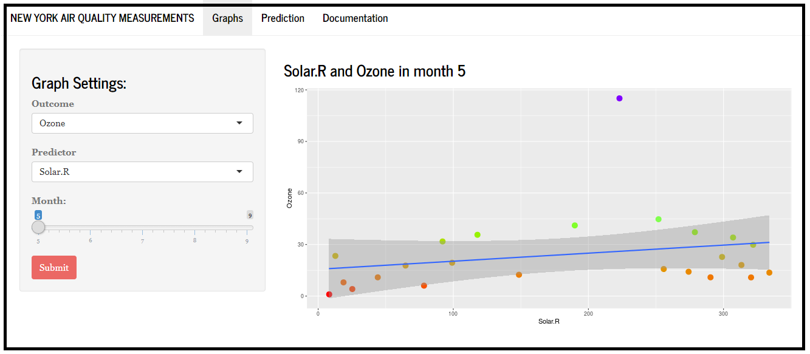

```{r setup, include=FALSE}
knitr::opts_chunk$set(echo = FALSE)
```

## Introduction

Have you ever wondered why the air in New York city is so... smelly?
Or what its happening to the Ozone when the temperature is high and there's little wind?

Well, now you can get some answers! This Shiny app will do wonders for you!

**What the web app does?**

- Quickly explore `airquality` data set
- Find relations between variables
- Simple linear regression model (one regressor)
- Predict Ozone values by user inputs

## `airquality` data set preview

```{r echo=TRUE}
data("airquality")
head(airquality)
```

## App User Interface

<center>{width=80%}</center>
<center>Just an example</center>

## Links

- Shiny web app: https://jamorello.shinyapps.io/DDP-Course-Project/
- Source Code: 

