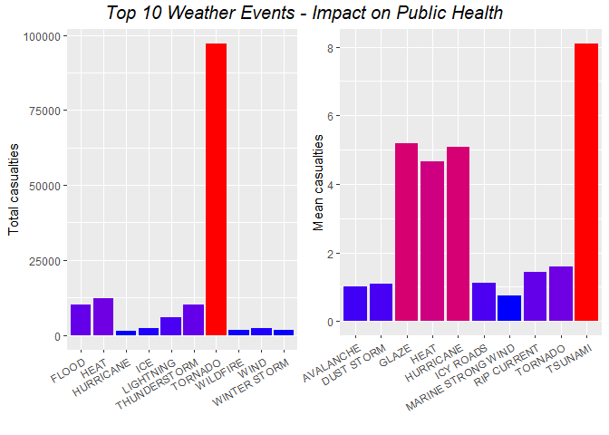
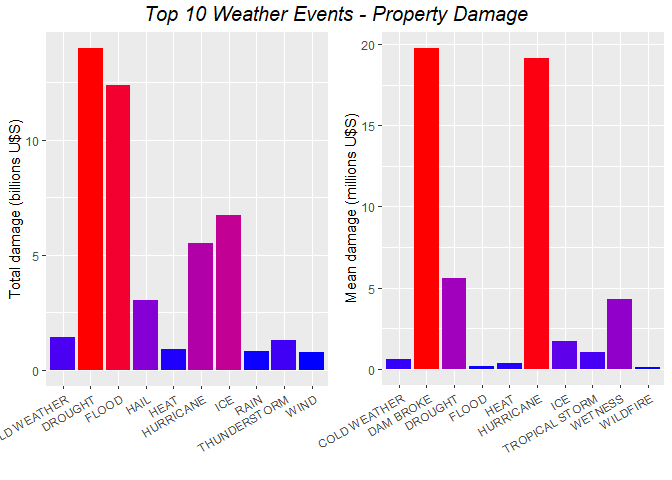

# Synopsis

Severe weather events can cause both public health and economic problems for communities and municipalities: they can result in fatalities, injuries, property damage, and agricultural loses. Preventing such outcomes to the extent possible is a key concern for the general public and is a responsibility of those in charge of the public administration, being of a municipality or being of a country. 

This project involves exploring the U.S. National Oceanic and Atmospheric Administration's (NOAA) storm database. This database tracks characteristics of major storms and weather events in the United States, including when and where they occur, as well as estimates of any fatalities, injuries, and property damage.

To prepare against severe weather events and prioritize resources, we have put as objective answering the following questions:

* Which types of events are most harmful with respect to population health?
* which types of events have the greatest negative economic consequences?

We have concluded that the most frequent weather events in the dataset are also the most concerning: while Tornados caused by far the most human casualties through 1950-2011, Thunderstorm, Hail, and Floods caused the biggest negative impact on the economy damaging property and agricultural assets in the same period. 

Nevertheless, we should be aware that the most infrequent or improbable weather events such as Tsunamis, Dams break, Hurricanes, and Typhoons bring too a lot of death and destruction.  

# Data Processing

The data that this project uses come in the form of a comma-separated-value file compressed via the bzip2 algorithm to reduce its size. The file was downloaded from here: [Storm Data](https://d396qusza40orc.cloudfront.net/repdata%2Fdata%2FStormData.csv.bz2) [47Mb]

There is also some documentation of the database available. 

* National Weather Service [Storm Data Documentation](https://d396qusza40orc.cloudfront.net/repdata%2Fpeer2_doc%2Fpd01016005curr.pdf)
* National Climatic Data Center Storm Events [FAQ](https://d396qusza40orc.cloudfront.net/repdata%2Fpeer2_doc%2FNCDC%20Storm%20Events-FAQ%20Page.pdf)

The events in the database start in the year 1950 and end in November 2011. In the earlier years of the database there are generally fewer events recorded, most likely due to a lack of good records. More recent years should be considered more complete.

### Loading packages


```r
library(readr)
library(dplyr)
library(ggplot2)
library(grid)
library(gridExtra)
```

### Downloading File


```r
# Make sure that the directory where the data is to be stored exist
if(!file.exists("./data")){dir.create("./data")}
# Create a vector named "URL" with the URL address
URL <- "https://d396qusza40orc.cloudfront.net/repdata%2Fdata%2FStormData.csv.bz2"
# Set download path directory
dwnld_path <- "./data/storm_data.csv.bz2"
# Download file
download.file(URL, destfile=dwnld_path, method="curl")
```

### Loading/Reading file


```r
# By default, we are going to read all variables as character to not let the
# package "readr" guess wildly the data types and wait too long; later we´re going # to parse them
NOAA_data <- read_csv("data/storm_data.csv.bz2", col_types = cols(.default = "c"))
```

### Extracting and transforming variables

We are not interested in all the features of the data set (there are 37). To answer our questions, we are going to keep just a few features:

As weather event variable we keep:

* `EVTYPE`

As health variables we keep:

* `FATALITIES`
* `INJURIES`

As economic variables we keep:

* `PROPDMG`
* `PROPDMGEXP`
* `CROPDMG`
* `CROPDMGEXP`


```r
features <- c("EVTYPE", "FATALITIES", "INJURIES", "PROPDMG", "PROPDMGEXP", "CROPDMG", "CROPDMGEXP")
sub_NOAA <- NOAA_data[, features]
```

We´re also going to parse the data type of some features, as all of them were read as characters


```r
## As all numbers in these features has as decimal ".00", we replace those 
## decimals to parse the variables to integers
sub_NOAA$FATALITIES <- sub("\\.00", "", sub_NOAA$FATALITIES)
sub_NOAA$FATALITIES <- parse_integer(sub_NOAA$FATALITIES)
sub_NOAA$INJURIES <- sub("\\.00", "", sub_NOAA$INJURIES)
sub_NOAA$INJURIES <- parse_integer(sub_NOAA$INJURIES)

## We keep these features as doubles/decimals
sub_NOAA$PROPDMG <- parse_double(sub_NOAA$PROPDMG)
sub_NOAA$CROPDMG <- parse_double(sub_NOAA$CROPDMG)
```

The first thing we´ll do with the data, is to merge `FATALITIES` and `INJURIES` in a single feature called `CASUALTIES`, as this term encompasses the other two and because simplifies our analysis. In the same operation, we drop the former features.


```r
sub_NOAA <- mutate(sub_NOAA, CASUALTIES = FATALITIES + INJURIES)
sub_NOAA <- subset(sub_NOAA, select = -c(FATALITIES, INJURIES))
```


`PROPDMGEXP` and `CROPDMGEXP` features are composed of a series of characters
that represent exponents:

* NA = 10^0 = 1
* [+, -, ?] = 10^0 = 1
* [1-8] = 10^ [1-8]
* H-h = 10^2 (hundreds)
* K-k = 10^3 (thousands)
* M-m = 10^6 (millions)
* B = 10^9 (billions)

We´re going to transform the character variables in those features to represent numeric values:


```r
# `PROPDMGEXP` feature
for (number in as.character(c(0:8))) {
  num <- paste("^", number, "$", sep="")
  sub_NOAA$PROPDMGEXP[grep(num, sub_NOAA$PROPDMGEXP)] <- paste("1e+0",
                                                               number,sep="")
}
sub_NOAA$PROPDMGEXP[is.na(sub_NOAA$PROPDMGEXP)] <- "1e+00"
sub_NOAA$PROPDMGEXP[grep("^\\+|^-|^\\?", sub_NOAA$PROPDMGEXP)] <- "1e+00"
sub_NOAA$PROPDMGEXP[grep("H|h", sub_NOAA$PROPDMGEXP)] <- "1e+02"
sub_NOAA$PROPDMGEXP[grep("K|k", sub_NOAA$PROPDMGEXP)] <- "1e+03"
sub_NOAA$PROPDMGEXP[grep("M|m", sub_NOAA$PROPDMGEXP)] <- "1e+06"
sub_NOAA$PROPDMGEXP[grep("B", sub_NOAA$PROPDMGEXP)] <- "1e+09"


# `CROPDMGEXP` feature
for (number in as.character(c(0:8))) {
  num <- paste("^", number, "$", sep="")
  sub_NOAA$CROPDMGEXP[grep(num, sub_NOAA$CROPDMGEXP)] <- paste("1e+0", number,
                                                               sep="")
}
sub_NOAA$CROPDMGEXP[is.na(sub_NOAA$CROPDMGEXP)] <- "1e+00"
sub_NOAA$CROPDMGEXP[grep("^\\+|^-|^\\?", sub_NOAA$CROPDMGEXP)] <- "1e+00"
sub_NOAA$CROPDMGEXP[grep("H|h", sub_NOAA$CROPDMGEXP)] <- "1e+02"
sub_NOAA$CROPDMGEXP[grep("K|k", sub_NOAA$CROPDMGEXP)] <- "1e+03"
sub_NOAA$CROPDMGEXP[grep("M|m", sub_NOAA$CROPDMGEXP)] <- "1e+06"
sub_NOAA$CROPDMGEXP[grep("B", sub_NOAA$CROPDMGEXP)] <- "1e+09"

# Parse both features to integer
sub_NOAA$PROPDMGEXP <- parse_number(sub_NOAA$PROPDMGEXP)
sub_NOAA$CROPDMGEXP <- parse_number(sub_NOAA$CROPDMGEXP)
```

And then we´re going to multiply the rows in `PROPDMG` and `CROPDMG` by their
respective exponents in `PROPDMGEXP` and `CROPDMGEXP`. After that, we drop the
exponent features.


```r
sub_NOAA$PROPDMG <- sub_NOAA$PROPDMG * sub_NOAA$PROPDMGEXP
sub_NOAA$PROPDMG <- sub_NOAA$CROPDMG * sub_NOAA$CROPDMGEXP

sub_NOAA <- subset(sub_NOAA, select = -c(PROPDMGEXP, CROPDMGEXP))
```

Now we´re going to work on the `EVTYPE` feature. While the National Weather Service documentation says that the data contains 48 events type, in the current
data there are actually 977 different event type. 


```r
length(unique(sub_NOAA$EVTYPE))
```

```
## [1] 977
```


This is due a lack of standardization: some events have the correct name; a lot of other have slightly different names (but they are the same); various names are a combination of events; a there are names that do not appear in the documentation. So, we´re going to do the following things: 

1) Keep the ones that are already correct, 
2) keep the first event name of those that have multiple (combination with "/"; we assume that the first name event is more important than the others), 
3) transform the name of those events that aren´t in the documentation but are related to the ones that figure there, 
4) correct the misspelled names, and 
5) group a few miscellaneous events.


```r
# We load to a vector all the event names from the documentation
events <- c(
  "Astronomical Low Tide", "Avalanche", "Blizzard",
  "Coastal Flood", "Cold/Wind Chill", "Debris Flow",
  "Dense Fog", "Dense Smoke", "Drought",
  "Dust Devil", "Dust Storm", "Excessive Heat",
  "Extreme Cold/Wind Chill", "Flash Flood", "Flood",
  "Frost/Freeze", "Funnel Cloud", "Freezing Fog",
  "Hail", "Heat", "Heavy Rain",
  "Heavy Snow", "High Surf", "High Wind", 
  "Hurricane", "Ice Storm", "Lake-Effect Snow",
  "Lakeshore Flood", "Lightning", "Marine Hail",
  "Marine High Wind", "Marine Strong Wind", "Marine Thunderstorm Wind",
  "Rip Current", "Seiche", "Sleet",
  "Storm Surge/Tide", "Strong Wind", "Thunderstorm Wind",
  "Tornado", "Tropical Depression", "Tropical Storm",
  "Tsunami", "Volcanic Ash", "Waterspout",
  "Wildfire", "Winter Storm", "Winter Weather")


# There are event names with lower characters. To find them all easily, we'll
# make all names upper case.
sub_NOAA$EVTYPE <- toupper(sub_NOAA$EVTYPE)
events <- toupper(events)

# 
for (event in events) {
  # First we grab the event names that are like (in regex): 
  #       "^TORNADO/|TORNADO AND"
  # This mean: string that starts with "TORNADO/" or "TORNADO AND"
  sub_NOAA$EVTYPE[grep(pattern = paste(paste("^", event, "/|", sep=""),
                                       paste(event, "AND"), sep=""),
                       x = sub_NOAA$EVTYPE)] <- event
  
  # Second, we grab the events that start with the event name and have something
  # else added
   sub_NOAA$EVTYPE[grep(pattern = paste("^", event, sep=""),
                        x = sub_NOAA$EVTYPE)] <- event
}
```

After this transformations, there are yet a lot of event names:


```r
length(unique(sub_NOAA$EVTYPE))
```

```
## [1] 607
```

So we have to go deeper, with more attention to detail and working "manually", grouping more events by the first event name:


```r
sub_NOAA$EVTYPE[grep(pattern = "^THUNDERSTORM|^TSTM",
                     x = sub_NOAA$EVTYPE)] <- "THUNDERSTORM"

sub_NOAA$EVTYPE[grep(pattern = "^COASTAL",
                     x = sub_NOAA$EVTYPE)] <- "COASTAL"

sub_NOAA$EVTYPE[grep(pattern = "^WIND",
                     x = sub_NOAA$EVTYPE)] <- "WIND"

sub_NOAA$EVTYPE[grep(pattern = "^FROST",
                     x = sub_NOAA$EVTYPE)] <- "FROST/FREEZE"

sub_NOAA$EVTYPE[grep(pattern = "^SNOW",
                     x = sub_NOAA$EVTYPE)] <- "SNOW"

sub_NOAA$EVTYPE[grep(pattern = "^LAKE FLOOD",
                     x = sub_NOAA$EVTYPE)] <- "LAKESHORE FLOOD"

sub_NOAA$EVTYPE[grep(pattern = "^STORM SURGE",
                     x = sub_NOAA$EVTYPE)] <- "STORM SURGE/TIDE"
```

Next step is grouping events by a certain name in any place:


```r
sub_NOAA$EVTYPE[grep(pattern = "BLIZZARD",
                     x = sub_NOAA$EVTYPE)] <- "BLIZZARD"

sub_NOAA$EVTYPE[grep(pattern = "DAM",
                     x = sub_NOAA$EVTYPE)] <- "DAM BROKE"

sub_NOAA$EVTYPE[grep(pattern = "FOG",
                     x = sub_NOAA$EVTYPE)] <- "FOG"

sub_NOAA$EVTYPE[grep(pattern = "FUNNEL",
                     x = sub_NOAA$EVTYPE)] <- "FUNNEL CLOUD"

sub_NOAA$EVTYPE[grep(pattern = "GLAZE",
                     x = sub_NOAA$EVTYPE)] <- "GLAZE"

sub_NOAA$EVTYPE[grep(pattern = "HEAT",
                     x = sub_NOAA$EVTYPE)] <- "HEAT"

sub_NOAA$EVTYPE[grep(pattern = "HEAVY RAIN",
                     x = sub_NOAA$EVTYPE)] <- "HEAVY RAIN"

sub_NOAA$EVTYPE[grep(pattern = "HEAVY SNOW",
                     x = sub_NOAA$EVTYPE)] <- "HEAVY SNOW"

sub_NOAA$EVTYPE[grep(pattern = "SURF",
                     x = sub_NOAA$EVTYPE)] <- "SURF"

sub_NOAA$EVTYPE[grep(pattern = "TORNADO",
                     x = sub_NOAA$EVTYPE)] <- "TORNADO"

sub_NOAA$EVTYPE[grep(pattern = "(SEVERE|GUSTY) THUNDERSTORM",
                     x = sub_NOAA$EVTYPE)] <- "THUNDERSTORM"

sub_NOAA$EVTYPE[grep(pattern = "WALL CLOUD",
                     x = sub_NOAA$EVTYPE)] <- "WALL CLOUD"
```

There are also a lot of event names related with "cold", "rain", "flood", etc.:


```r
sub_NOAA$EVTYPE[grep(pattern = "COLD|COOL",
                     x = sub_NOAA$EVTYPE)] <- "COLD WEATHER"

sub_NOAA$EVTYPE[grep(pattern = "ICE|FROST|FREEZ",
                     x = sub_NOAA$EVTYPE)] <- "ICE"

sub_NOAA$EVTYPE[grep(pattern = "RAIN|PRECIP",
                     x = sub_NOAA$EVTYPE)] <- "RAIN"

sub_NOAA$EVTYPE[grep(pattern = "BURST",
                     x = sub_NOAA$EVTYPE)] <- "MICROBURST"

sub_NOAA$EVTYPE[grep(pattern = "FLOOD",
                     x = sub_NOAA$EVTYPE)] <- "FLOOD"

sub_NOAA$EVTYPE[grep(pattern = "FIRE",
                     x = sub_NOAA$EVTYPE)] <- "WILDFIRE"

sub_NOAA$EVTYPE[grep(pattern = "HOT",
                     x = sub_NOAA$EVTYPE)] <- "HEAT"

sub_NOAA$EVTYPE[grep(pattern = "WARM",
                     x = sub_NOAA$EVTYPE)] <- "WARM CONDITIONS"

sub_NOAA$EVTYPE[grep(pattern = "WET",
                     x = sub_NOAA$EVTYPE)] <- "WETNESS"

sub_NOAA$EVTYPE[grep(pattern = "DRY",
                     x = sub_NOAA$EVTYPE)] <- "DRY CONDITIONS"

sub_NOAA$EVTYPE[grep(pattern = "URBAN",
                     x = sub_NOAA$EVTYPE)] <- "URBAN STREAM"

sub_NOAA$EVTYPE[grep(pattern = "SLIDE",
                     x = sub_NOAA$EVTYPE)] <- "MUD/ROCK/LAND SLIDES"

sub_NOAA$EVTYPE[grep(pattern = "SMOKE",
                     x = sub_NOAA$EVTYPE)] <- "SMOKE"

sub_NOAA$EVTYPE[grep(pattern = "VOLCANIC",
                     x = sub_NOAA$EVTYPE)] <- "VOLCAN"

# A weird line to grab all events involving wind but not marine ones
sub_NOAA$EVTYPE[grep("WIND", sub_NOAA$EVTYPE)][!grepl("MARINE", sub_NOAA$EVTYPE[grep("WIND", sub_NOAA$EVTYPE)])] <- "WIND"

# A weird line to grab all events involving hail but not marine ones
sub_NOAA$EVTYPE[grep("HAIL", sub_NOAA$EVTYPE)][!grepl("MARINE", sub_NOAA$EVTYPE[grep("HAIL", sub_NOAA$EVTYPE)])] <- "HAIL"

# A weird line to grab all events involving snow but not lake effect related ones
sub_NOAA$EVTYPE[grep("SNOW", sub_NOAA$EVTYPE)][!grepl("LAKE EFFECT", sub_NOAA$EVTYPE[grep("SNOW", sub_NOAA$EVTYPE)])] <- "SNOW" 

# A weird line to grab all events involving stream but not urban ones
sub_NOAA$EVTYPE[grep("STREAM", sub_NOAA$EVTYPE)][!grepl("URBAN", sub_NOAA$EVTYPE[grep("STREAM", sub_NOAA$EVTYPE)])] <- "STREAM"

sub_NOAA$EVTYPE[grep(pattern = "WINTER MIX|WINTERY MIX|WINTRY MIX",
                     x = sub_NOAA$EVTYPE)] <- "WINTER WEATHER"
```

Other events names are simply written incorrectly:


```r
sub_NOAA$EVTYPE[grep(pattern = "AVALANCE",
                     x = sub_NOAA$EVTYPE)] <- "AVALANCHE"

sub_NOAA$EVTYPE[grep(pattern = "DUSTSTORM",
                     x = sub_NOAA$EVTYPE)] <- "DUST STORM"

sub_NOAA$EVTYPE[grep(pattern = "DUST DEVEL",
                     x = sub_NOAA$EVTYPE)] <- "DUST DEVIL"

sub_NOAA$EVTYPE[grep(pattern = "VOG",
                     x = sub_NOAA$EVTYPE)] <- "FOG"

sub_NOAA$EVTYPE[grep(pattern = "LAKE-EFFECT",
                     x = sub_NOAA$EVTYPE)] <- "LAKE EFFECT SNOW"

sub_NOAA$EVTYPE[grep(pattern = "LIGHTING|LIGNTNING",
                     x = sub_NOAA$EVTYPE)] <- "LIGHTNING"

sub_NOAA$EVTYPE[grep(pattern = "MARINE TSTM WIND",
                     x = sub_NOAA$EVTYPE)] <- "MARINE THUNDERSTORM WIND"

sub_NOAA$EVTYPE[grep(pattern = "WATER SPOUT|WAYTERSPOUT",
                     x = sub_NOAA$EVTYPE)] <- "WATERSPOUT"

sub_NOAA$EVTYPE[grep(pattern = "RAPIDLY RISING WATER|HIGH WATER",
                     x = sub_NOAA$EVTYPE)] <- "FLOOD"

sub_NOAA$EVTYPE[grep(pattern = "TORNDAO",
                     x = sub_NOAA$EVTYPE)] <- "TORNADO"

sub_NOAA$EVTYPE[grep(pattern = "THUNDERESTORM|THUNERSTORM|THUNDEERSTORM|THUNDERTSORM|                     THUNDERTORM|TUNDERSTORM|THUNDERSTROM|THUNDESTORM",
                     x = sub_NOAA$EVTYPE)] <- "THUNDERSTORM"

sub_NOAA$EVTYPE[grep(pattern = "WND",
                     x = sub_NOAA$EVTYPE)] <- "WIND"

sub_NOAA$EVTYPE[grep(pattern = "BEACH EROSIN",
                     x = sub_NOAA$EVTYPE)] <- "BEACH EROSION"
```

There are also some random "summary" event names


```r
sub_NOAA$EVTYPE[grep(pattern = "SUMMARY",
                     x = sub_NOAA$EVTYPE)] <- "SUMMARY"
```

And a few "records" related to temperature we are going to group together:


```r
sub_NOAA$EVTYPE[grep(pattern = "RECORD",
                     x = sub_NOAA$EVTYPE)] <- "RECORDS"
```

The final step is to remove all those events who were recorded more than 10 times, this is, those events that have less than 10 observations in the data set. We´ll do this to set aside outliers that could mess up our analysis.


```r
occurrences <- data.frame(table(unlist(sub_NOAA$EVTYPE)))
select <- as.character(occurrences$Var1[occurrences$Freq > 10])
final_NOAA <- sub_NOAA[sub_NOAA$EVTYPE %in% select,]
```

At the end of all this transformations, we end up with 55 event names:


```r
length(unique(final_NOAA$EVTYPE))
```

```
## [1] 55
```

We have four more that the ones that are in the documentation (49) and we had reduced at least 17 times the original amount of event names (977). We have now grouped neatly some mayor events and now we can answer our project questions.

# Data Analysis

We could simply group all observations by events and sum all their casualties and economics damages and have a total per event. But we have to keep in mind that, for example, a group with a lot of periodical or frequent type of event with low cost/casualties could overshadow those groups with infrequent event but very high casualties and costs (the fact that the dataset contains data from 1950 to 2011 influences this). **So we are going to grab the sum and mean of casualties/costs, as well the number of times it happened/was registered divided by the years of data registration (61 years)** to have a better idea of frequency of weather events as well as their consequences.

The first thing we´ll do is group the data by events, summarize it´s total and mean of `CASUALTIES` and assign both results to variables. While we are at it, we order the data in descending order. In the end, we grab the top 10 rows/events of each dataset:


```r
# TOTAL CASUALTIES DATA
total_casualties <- final_NOAA %>% group_by(EVTYPE) %>% 
  summarise(total = sum(CASUALTIES))
total_casualties <-total_casualties[order(total_casualties$total,
                                          decreasing=TRUE),]
top_total_casualties <- total_casualties[1:10,]

# MEAN CASUALTIES DATA
mean_casualties <- final_NOAA %>% group_by(EVTYPE) %>% 
  summarise(mean = mean(CASUALTIES))
mean_casualties <-mean_casualties[order(mean_casualties$mean,
                                          decreasing=TRUE),]
top_mean_casualties <- mean_casualties[1:10,]
```

We´ll do also the same, grouping the data by events but summarizing it by total and median of `PROPDMG` and `CROPDMG`, assigning it to others variables:


```r
# TOTAL PROPERTY DAMAGE DATA
total_property <- final_NOAA %>% group_by(EVTYPE) %>% 
  summarise(total = sum(PROPDMG))
total_property <-total_property[order(total_property$total,
                                      decreasing=TRUE),]
top_total_property <- total_property[1:10,]

# MEAN PROPERTY DAMAGE DATA
mean_property <- final_NOAA %>% group_by(EVTYPE) %>% 
  summarise(mean = mean(PROPDMG))
mean_property <-mean_property[order(mean_property$mean,
                                    decreasing=TRUE),]
top_mean_property <- mean_property[1:10,]

# TOTAL CROP DAMAGE DATA
total_crop <- final_NOAA %>% group_by(EVTYPE) %>% 
  summarise(total = sum(CROPDMG))
total_crop <-total_crop[order(total_crop$total,
                              decreasing=TRUE),]
top_total_crop <- total_crop[1:10,]

# MEAN CROP DAMAGE DATA
mean_crop <- final_NOAA %>% group_by(EVTYPE) %>% 
  summarise(mean = mean(CROPDMG))
mean_crop <-mean_crop[order(mean_crop$mean,
                            decreasing=TRUE),]
top_mean_crop <- mean_crop[1:10,]
```

Finally, we sum all the occurrences of the event names and divide them by 61 (years of data registration. This would give us a roughly the times per year the event takes place). Order them in descending order to rank them.


```r
# TOTAL EVENT OCCURRENCES DIVIDED BY 61 YEARS OF DATA REGISTRATION
occurrences <- data.frame(table(unlist(final_NOAA$EVTYPE)))
occurrences$Freq <- occurrences$Freq / 61

# ORDER THE OCURRENCES IN DECREASING ORDER AND RANK THEM
occurrences <- occurrences[order(occurrences$Freq, decreasing=TRUE),]
row.names(occurrences) <- NULL
names(occurrences) <- c("Event", "Freq.")
```

### Which types of events are most harmful to population health?


```r
plot1 <- ggplot(top_total_casualties, aes(EVTYPE,total, fill=total))+geom_bar(stat="identity")+ theme(axis.text.x = element_text(angle = 30, hjust = 1), legend.position = "none")+scale_fill_gradient(low="blue", high="red")+labs(y="Total casualties", x="")

plot2 <- ggplot(top_mean_casualties, aes(EVTYPE,mean, fill=mean))+geom_bar(stat="identity")+ theme(axis.text.x = element_text(angle = 30, hjust = 1), legend.position = "none")+scale_fill_gradient(low="blue", high="red")+labs(y="Mean casualties", x="")

grid.arrange(plot1, plot2, ncol=2,
             top = textGrob("Top 10 Weather Events - Impact on Public Health",gp=gpar(fontsize=15,font=3)))
```

<!-- -->

Let´s check now how frequent are the top 5 weather events present in both graphs (extracted from the ones in red and/or purple):


```r
top_events <- c("TORNADO", "TSUNAMI", "GLAZE", "HEAT", "HURRICANE")
occurrences[occurrences$Event %in% top_events,]
```

```
##        Event       Freq.
## 4    TORNADO 994.8852459
## 18      HEAT  43.4918033
## 32 HURRICANE   4.7213115
## 45     GLAZE   0.7540984
## 52   TSUNAMI   0.3278689
```

### Which types of events have the greatest economic consequences?


```r
plot1 <- ggplot(top_total_property, aes(EVTYPE,total/1e+09, fill=total))+geom_bar(stat="identity")+ theme(axis.text.x = element_text(angle = 30, hjust = 1), legend.position = "none")+scale_fill_gradient(low="blue", high="red")+labs(y="Total damage (billions U$S)", x="")

plot2 <- ggplot(top_mean_property, aes(EVTYPE,mean/1e+06, fill=mean))+geom_bar(stat="identity")+ theme(axis.text.x = element_text(angle = 30, hjust = 1), legend.position = "none")+scale_fill_gradient(low="blue", high="red")+labs(y="Mean damage (millions U$S)", x="")

grid.arrange(plot1, plot2, ncol=2,
             top = textGrob("Top 10 Weather Events - Property Damage",gp=gpar(fontsize=15,font=3)))
```

<!-- -->

Let´s check now how frequent are the top 5 weather events present in both graphs (extracted from the ones in red and/or purple):


```r
top_events <- c("DROUGHT", "DAM BROKE", "HURRICANE", "FLOOD", "ICE")
occurrences[occurrences$Event %in% top_events,]
```

```
##        Event        Freq.
## 3      FLOOD 1341.8360656
## 14       ICE   64.5245902
## 19   DROUGHT   41.0000000
## 32 HURRICANE    4.7213115
## 53 DAM BROKE    0.2459016
```


```r
plot1 <- ggplot(top_total_crop, aes(EVTYPE,total/1e+03, fill=total))+geom_bar(stat="identity")+ theme(axis.text.x = element_text(angle = 30, hjust = 1), legend.position = "none")+scale_fill_gradient(low="blue", high="red")+labs(y="Total damage (thousand U$S)", x="")

plot2 <- ggplot(top_mean_crop, aes(EVTYPE,mean, fill=mean))+geom_bar(stat="identity")+ theme(axis.text.x = element_text(angle = 30, hjust = 1), legend.position = "none")+scale_fill_gradient(low="blue", high="red")+labs(y="Mean damage (U$S)", x="")

grid.arrange(plot1, plot2, ncol=2,
             top = textGrob("Top 10 Weather Events - Crop Damage",gp=gpar(fontsize=15,font=3)))
```

<!-- -->

Let´s check now how frequent are the top 5 weather events present in both graphs (extracted from the ones in red and/or purple):


```r
top_events <- c("HAIL", "TYPHOON", "FLOOD", "HURRICANE", "THUNDERSTORM")
occurrences[occurrences$Event %in% top_events,]
```

```
##           Event        Freq.
## 1  THUNDERSTORM 5324.8032787
## 2          HAIL 4735.0491803
## 3         FLOOD 1341.8360656
## 32    HURRICANE    4.7213115
## 54      TYPHOON    0.1803279
```

# Results

After looking at the graphs and event-frequency table, we can reach the conclusion that the most frequent weather events in EE.UU. (the top 4 in our `occurrences` table) are also the most concerning: while Tornados caused by far the most human casualties through 1950-2011, Thunderstorm, Hail, and Floods caused the biggest negative impact on the economy damaging property and agricultural assets in the same period. 

Nevertheless, we should be aware that the most infrequent or improbable weather events such as Tsunamis, Dams break, Hurricanes, and Typhoons bring too a lot of death and destruction. 

While we keep an eye in the most frequent weather events that requires our immediate action and available resources, with the other eye we should be alert to the infrequent or improbable events and be ready to act swiftly.
